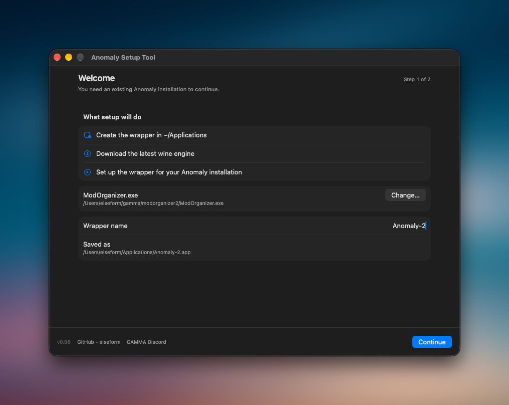
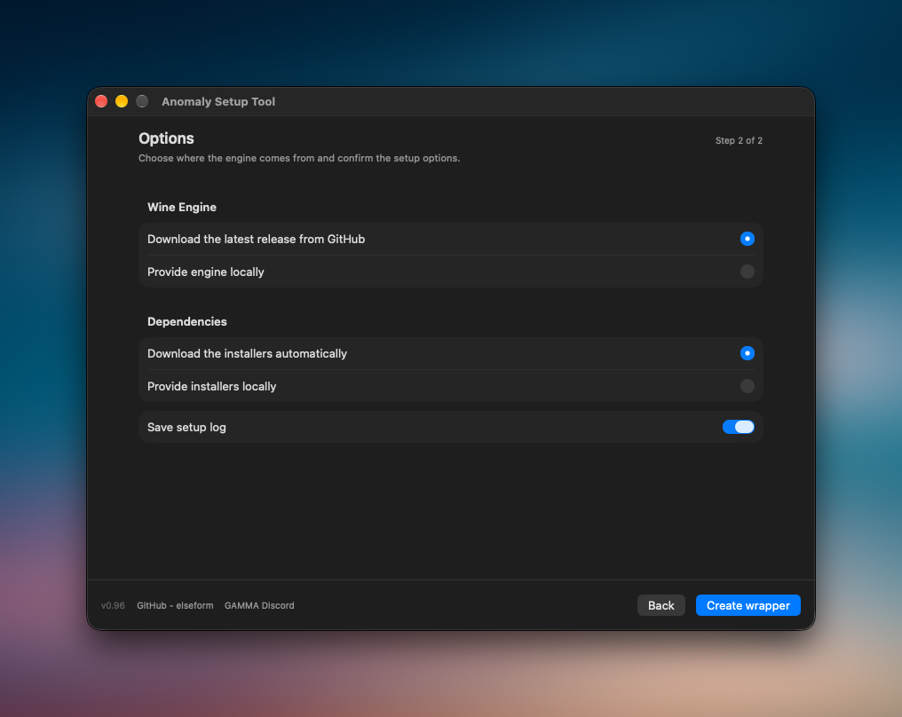
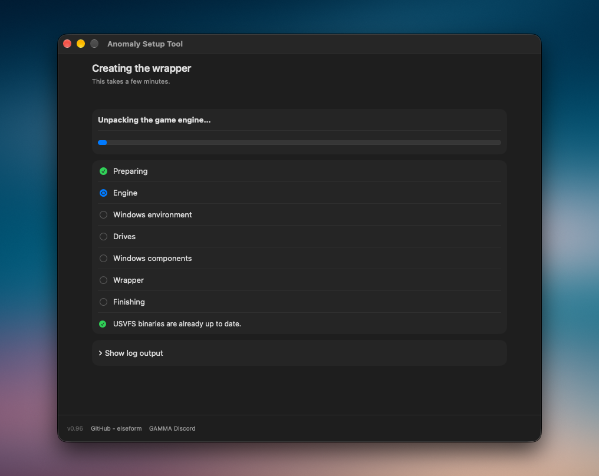
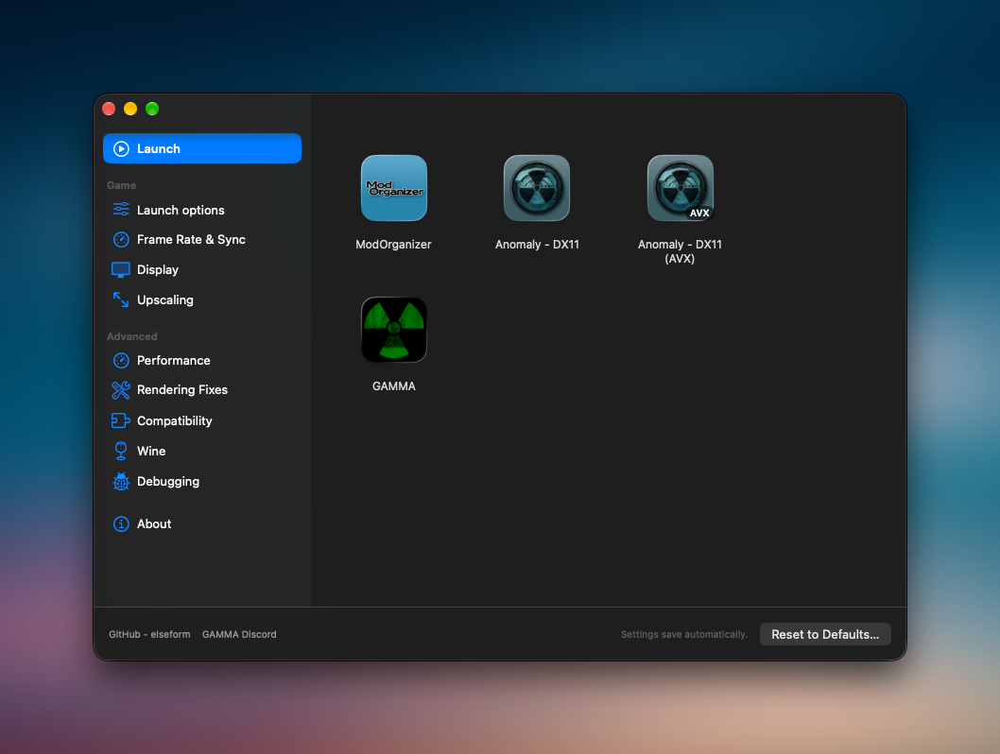
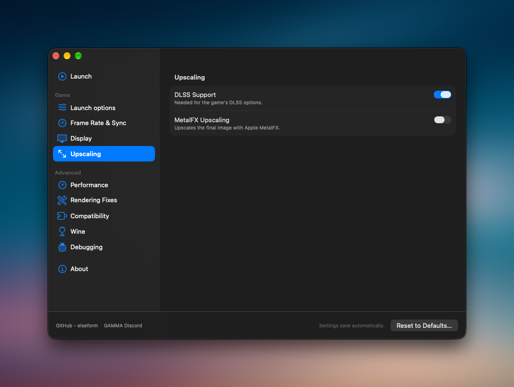
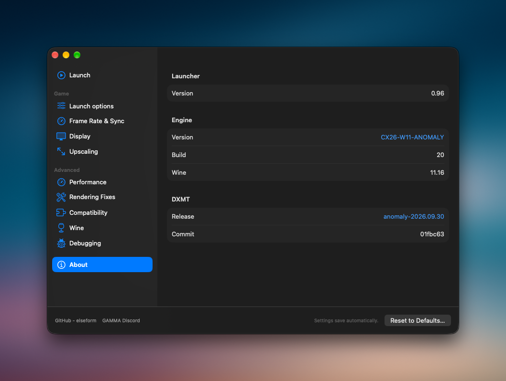

# Anomaly Setup Tool

Run your existing **S.T.A.L.K.E.R. Anomaly** installation on macOS with a native setup wizard and launcher. **Setup Tool** creates a Wine wrapper using [anomaly-wine-engine](https://github.com/elseform/anomaly-wine-engine) and a [custom DXMT fork](https://github.com/elseform/dxmt/releases).
The wrapper’s **Launcher / Configurator** provides a native launcher for MO2-managed Anomaly installation.

The tool does not install Anomaly or GAMMA. You need an installation already on your Mac.

**[Download Anomaly Setup Tool](https://github.com/elseform/anomaly-setup-tool/releases)** — extract the archive and open `Anomaly Setup Tool.app`. Check the release notes when using an older build.

THIS SHADER PACK IS REQUIRED TO BE INSTALLED FOR DXMT TO WORK PROPERLY: https://github.com/elseform/gamma-mods/tree/master/Metal-compatible%20Shaders

## Requirements

- An Apple Silicon Mac running macOS 26 or newer, with Rosetta 2 installed.
- An existing Anomaly installation managed by `ModOrganizer.exe`.
- Python 3 available at `/usr/bin/python3`, `/opt/homebrew/bin/python3`, or `/usr/local/bin/python3`.

## Setup Tool

<p>
  <a href="docs/images/setup-welcome.png"></a>
  <a href="docs/images/setup-options.png"></a>
  <a href="docs/images/setup-progress.png"></a>
</p>

1. Click **Choose…** and select your installation’s `ModOrganizer.exe`, or another executable.
2. Enter a **Wrapper name**, check the **Saved as** location, and click **Continue**.
3. On **Options**, keep automatic engine and installer downloads selected. Alternatively, choose **Provide engine locally** for a `.tar.xz` archive and **Provide installers locally** for a folder of runtime files.
4. Leave **Save setup log** enabled, then click **Create wrapper**. Wait for setup to finish.
5. Open your new app in `~/Applications` to use its launcher.

When the selected executable’s folder contains `ModOrganizer.exe`, setup also updates its USVFS files if needed. Differing originals are backed up in that folder under `anomaly-setup-tool-backups/usvfs-<timestamp>/` before replacement.

## Launcher / Configurator

<p>
  <a href="docs/images/launcher.png"></a>
  <a href="docs/images/upscaling.png"></a>
  <a href="docs/images/about.png"></a>
</p>

Choose a tile on **Launch**:

- **ModOrganizer** opens MO2.
- **Anomaly - DX11** and **Anomaly - DX11 (AVX)** start MO2 shortcuts. Your MO2 executable list must contain the exact titles `Anomaly (DX11)` and `Anomaly (DX11-AVX)` respectively.
- Custom tiles start executables added in **Executables**. Use **Add custom executable…**, edit the tile name, set its startup arguments, or remove an entry with **−**.

Set or change the MO2 path in **Executables**. Startup arguments are set per custom executable and are never passed to MO2; configure MO2 game arguments in MO2 itself. **Reset to Defaults…** is on the **About** page.

The sidebar groups frame rate and sync, display, and upscaling controls, plus advanced performance, rendering fixes, compatibility, Wine, and debugging settings.

## Troubleshooting

Keep these logs when asking for help:

- Setup: `~/Library/Logs/anomaly-setup-tool/<app name>-YYYYMMDD-HHMMSS.log` (with **Save setup log** enabled).
- Launch: `~/Library/Logs/<app name>/launcher.log`.

Share the relevant log and versions from **About** in the [GAMMA Discord support channel](https://discord.com/channels/912320241713958912/1315449108797980762), also linked inside the app.

## Build and Test

Building requires full Xcode with Icon Composer support, selected through `xcode-select`. End users do not need Xcode.

```sh
./build.sh
./test.sh
```

`./build.sh` builds, ad-hoc signs, and installs the app into `~/Applications`. `./test.sh` runs automated tests and a build smoke check without installing. Run `./build.sh` after changes to keep the installed app current.
